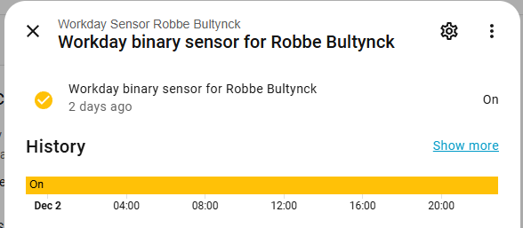
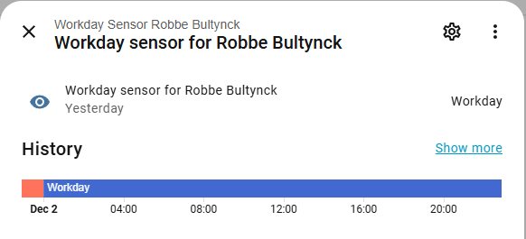

# Home Assistant Skyline Vacation Calendar Integration

Home Assistant Integration to sync your Skyline Communications Vacation Calendar with your HA. 

## Installation

### HACS
[](https://my.home-assistant.io/redirect/hacs_repository/?owner=DhrMaes&repository=HomeAssistant-SLC-VacationCalendar&category=integration)
 
### Manual
* Install the File Editor Add-On:
* In the File Editor create a **custom_components** folder.
* In the custom_components folder create a **skyline_communications_vacation_calendar** folder
* In the skyline_communications_vacation_calendar folder add all the .py files from this repo (except for the *test.py*) and also the *manifest.json*, *quality_scale.yaml* and the *strings.json*
* Reboot your Home Assistant

## Setup

### Step 1: Find the correct element

* Go to the [domain-metrics-cloud](https://domainmetrics-skyline.on.dataminer.services/) DMA (or via the local address, you'll need to be connected to HQ to use this: [domain-metrics-local](https://domain-metrics.skyline.local/))
* Find the element running the **Skyline Calendar Fetcher** connector that contains the calendar information for the user you want to setup. For instance for me the element is called "*Fiber Calendar*" with element id "*477/267*", Note down what the element id is for your use case. The element id should always be 2 numbers with a forward slash in between.
* Open the element and navigate to the Calendar page. Take note of the exact name of the rows you want to get calendar information for. In my case it's "*Arne Maes*".

### Step 2: Setup the integration

* Go to the Integrations page and press the Add Integration button.
* Search for **Skyline Communications Vacation Calendar**.


* Fill in the API Key (you'll need to request one first, you can just text me for a key).


* Fill in your exact name and element id (the one you got from step 1).


* Press submit and your setup is complete.

## Usage

The following enteties will be created: 
- binary sensor: indicating of today is a workday for the user or not. You could then the sensor in automations, for instance heat the car when my alarm goes of on a workday.
  
- text sensor: indicating the current day as one of the following options: "Workday, WfH, Absence, Public_Holiday, Weekend"
  


### Automation 

For example you could create an automation that will warm up your car when your alarm goes off in the morning but only if it's a working day and it's not a work from home day.

```yaml
description: "Automatic Car Warm-Up"
mode: single
triggers:
  - trigger: time
    at: sensor.dhrmaes_oneplus_nord_2t_5g_next_alarm
conditions:
  - condition: state
    entity_id: binary_sensor.workday_binary_sensor_for_arne_maes
    state: "on"
  - condition: not
    conditions:
      - condition: state
        entity_id: sensor.workday_sensor_for_arne_maes
        state: WfH
actions:
  - type: turn_on
    device_id: 1b97cda7c171f9bb89ed3b4eb4b72eb6
    entity_id: 4d08c1c41fb49e6a990a25e65d2166c7
    domain: switch
  - delay:
      hours: 0
      minutes: 15
      seconds: 0
  - type: turn_off
    device_id: 1b97cda7c171f9bb89ed3b4eb4b72eb6
    entity_id: 4d08c1c41fb49e6a990a25e65d2166c7
    domain: switch
```


## Support

For additional help, reach out to [arne.maes@skyline.be](mailto:arne.maes@skyline.be)
